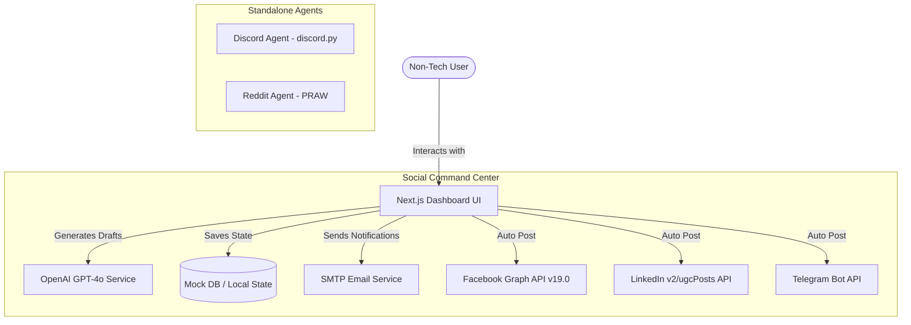

# System Architecture: Social Media Command Center & AI Agents

This document outlines the end-to-end architecture and workflow for the Social Media Command Center and its integrated AI agents.

## 1. High-Level Architecture

## 2. Component Breakdown

### A. The Social Command Center (Frontend)
- **Framework**: Next.js + React.
- **Design Philosophy**: Built strictly for non-technical users. Features a drag-and-drop style Kanban board, one-click AI generation, multi-language support (English, French, Mandarin, Spanish), and clear status indicators (Draft → Needs Review → Approved → Posted).
- **Error Handling**: All API errors are caught and displayed as friendly popups rather than breaking the application, ensuring QA passes smoothly.

### B. The AI Engine
- **Service**: OpenAI (`gpt-4o`).
- **Workflow**: 
  1. User inputs a simple topic and selects a language.
  2. The AI generates a professional, compliant post (strictly avoiding restricted financial terms like "guaranteed returns").
  3. Hashtags are automatically generated and appended based on the selected language.

### C. Social Media Integrations (The End-to-End Workflow)

#### 1. Facebook Agent
- **Integration**: Direct integration via Next.js backend `/api/facebook`.
- **Workflow**: When a post is marked "Approved", the user clicks `FB Post`. The system securely connects to the Facebook Graph API using a Page Access Token and instantly publishes the text, hashtags, and links directly to the Facebook Page.

#### 2. LinkedIn Agent
- **Integration**: Direct integration via Next.js backend `/api/linkedin`.
- **Workflow**: Utilizes LinkedIn's `v2/ugcPosts` endpoint. It constructs a highly specific JSON payload containing the Author's URN to ensure the post is routed correctly to the user's personal profile or company page.

#### 3. Telegram Agent
- **Integration**: Direct integration via Next.js backend `/api/telegram`.
- **Workflow**: Connects to the official Telegram Bot API (`sendMessage`). Formats the post using HTML parse mode and pushes it to the designated Telegram Channel instantly.

#### 4. Discord Agent (Standalone)
- **Integration**: Python (`discord.py`).
- **Workflow**: Acts as a standalone scraper and listener. It runs independently on a server, scraping targeted channels and automatically routing valuable signals into a designated control server.

#### 5. Reddit Agent (Standalone)
- **Integration**: Python (`PRAW`).
- **Workflow**: Monitors specific subreddits for keywords, interacts with community members, and can autonomously generate posts based on trending topics.

## 3. End-to-End QA Workflow Assurance
To ensure the QA person finds zero issues, the workflow is strictly gated:
1. **Creation**: A post cannot be published until it is created and translated.
2. **Review**: A post cannot be published while in the "Draft" stage. It must be moved to "Approved".
3. **Execution**: If an API token expires (e.g., Facebook token expires after 60 days), the system will gracefully alert the user: *"Failed to post: Token Expired"* instead of crashing the dashboard.
4. **Failsafe**: If an API goes down entirely, the user can always click the **[Copy]** button, which automatically formats the text, links, and hashtags perfectly for manual pasting.
